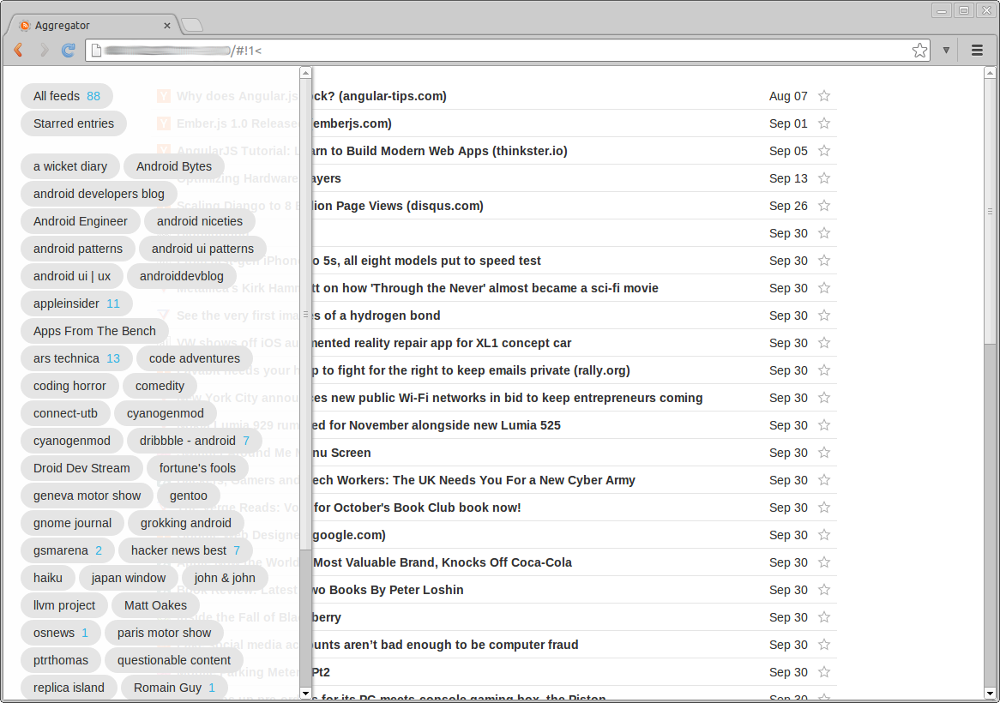

# Aggregator

Python based feeds reader/aggregator.

The idea behind this project is to create a replacement for Google Reader that serves one user and runs on a Raspberry Pi.

Planned features:
- Support for RSS and Atom feeds ✔
- Entry filtering support
- Feed aggregation / syndication
- OPML import ✔
- JSON-based API ✔
- Web client ✔
- Mobile web client ✔
- Android client

### License

Aggregator is free software: you can redistribute it and/or modify
it under the terms of the [GNU General Public License](http://www.gnu.org/licenses/gpl.txt) as published by
the Free Software Foundation, either version 3 of the License, or
(at your option) any later version.

### Quick Project Setup:

	# make sure virtualenv is installed
	pip install virtualenv

	# go to the project dir
	cd <proj-dir>

	# create environment
	virtualenv environment

	# activate the environment for the current terminal
	. environment/bin/activate

	# install required packages
	pip install -r requirements.txt

### Polling

To keep the database updated a cron job should **poll** every 5 minutes.

	# crontab -e
	*/5 * * * * curl http://localhost:8000/api/update/feeds >/dev/null 2>&1
	0   0 1 * * curl http://localhost:8000/api/update/favicons >/dev/null 2>&1

### nginx + uWSGI Configuration:

Requires:
* nginx and uWSGI (with the python plugin)
* project clone in /var/www/aggregator

/etc/nginx/sites-enabled/default

	server {
		listen   8000;
		charset utf-8;
		root /var/www/aggregator;
		server_name 0.0.0.0;

		location / {
	#		auth_basic "Restricted Access";
	#		auth_basic_user_file /var/www/aggregator/.htpasswd;

			include uwsgi_params;
			uwsgi_pass unix:/tmp/uwsgi.aggregator.socket;
			uwsgi_param UWSGI_PYHOME /var/www/aggregator/environment;
			uwsgi_param UWSGI_CHIDIR /var/www/aggregator;
			uwsgi_param UWSGI_SCRIPT server;
		}
	}

If you require HTTP Basic Authentication uncomment the two lines and make sure only *root* can edit the passwd file.

/etc/uwsgi/apps-enabled/aggregator.ini

	[uwsgi]
	plugins=python
	socket=/tmp/uwsgi.aggregator.socket
	pythonpath=/var/www/aggregator

### Web Client Screenshots

